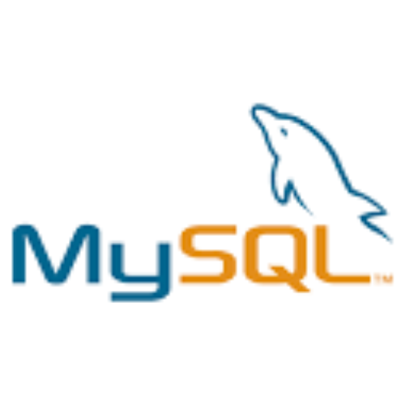
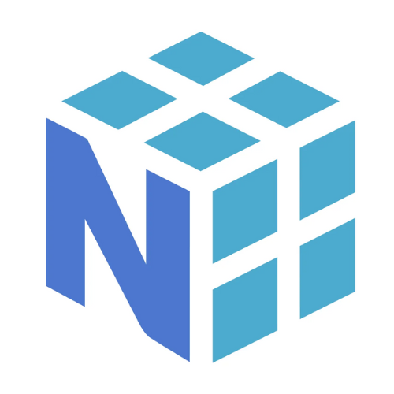
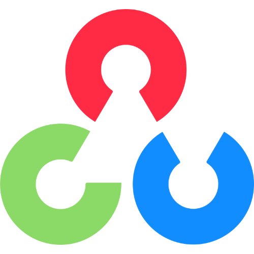
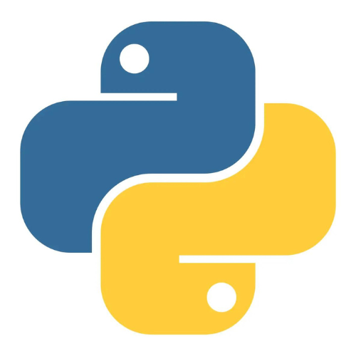
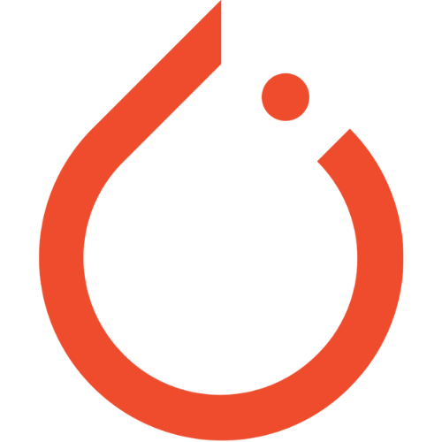
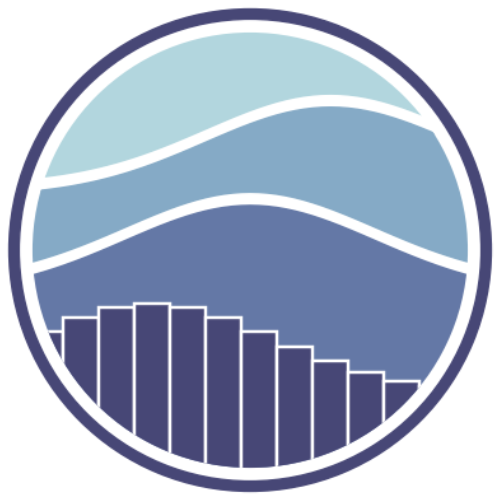
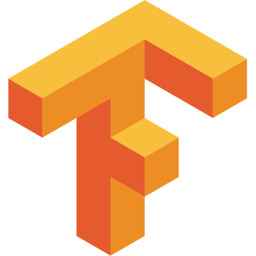

<h1 align="center">
  Hello!  I am Abdelrahman Youssry  
</h1>

<h3 align="center">
  

  
 

  

 Abdelrahman Katkat |
 Machine Learning Engineer / AI Enthusiast
 Alexandria, Egypt
</h3>

Welcome to my GitHub profile! 🎉 I'm a passionate Machine Learning Engineer with a strong background in developing innovative AI solutions, specializing in deep learning, natural language processing, and computer vision. 🌟 With a degree in Mechanical Engineering, I've transitioned into this exciting field where I blend my technical skills with creativity to tackle complex problems. Here, you'll find a collection of my projects, research, and contributions to the open-source community. 📚 I'm eager to explore the intersection of AI and real-world applications and collaborate on exciting projects that push the boundaries of what's possible in machine learning! 🚀✨

   
  
  
  

  

## 🛠️ Technical Stack

<h3 align="center"></h3>

    

 
<h3 align="center"></h3>

## 💼 Professional Experience

### Machine Learning Engineer, Omdena Company | March 2023 - Present | Remote
- **Budget Collector:** Developed an Art Classifier using Qwen Chat VL and EfficientNet B5.
- **Paradox House:** Assisted in developing a digital avatar solution using ComfyUI and motion diffusion models.
- **Reachbots Automation:** Developed an AI model for detecting weld defects using VGG16, RF, and SVM.
- **Abu Dhabi Data:** Developed a chatbot integrated with Abu Dhabi Open Data website, facilitating user queries.

### Mechanical Analysis Lead Engineer, Ventri | May 2022 - Present | Dubai - Remote
- Developed Python scripts for propeller design and selection.
- Utilized ARIMA and LSTM models for temperature variation prediction in battery packs.
- Designed cooling systems and specified thermal tests for battery packs.

### Mechanical Analysis Engineer, Brightskies Company | Feb 2022 - Jan 2023 | Alexandria, Egypt
- Used ARIMA and LSTM models for temperature prediction in battery packs.
- Developed predictive models using Ansys NTGK for forecasting battery temperatures.
- Designed and tested cooling systems for battery packs.

<h3 align="center"></h3>

  
## 🔍 Featured Projects

### [ Art Classifier - Budget Collector ](https://sudsy-flight-bed.notion.site/Budget-Collector-8669ec501fe748009555d98ecdd63b9b?pvs=4)
**Developed an art classifier using Qwen Chat VL and EfficientNet B5.**
- Extracted art descriptions and tags with Qwen Chat VL.
- Achieved 65% accuracy in style and genre classification.

### [ Digital Likeness Solution - Paradox House ](https://sudsy-flight-bed.notion.site/Digital-Likeness-0da38f4748f14a359c54e0e3092e360e?pvs=4)
**Contributed to developing a digital avatar with dynamic movements.**
- Utilized ComfyUI and motion diffusion models to generate a responsive avatar.
- Enabled text-based control for avatar movements.

### [ Weld Defect Detection - Reachbots Automation ](https://sudsy-flight-bed.notion.site/Weldment-Defect-Detection-2777ee646df24365954bc0fcbd82dc0a?pvs=4)
**Developed an AI model for detecting weld defects.**
- Used VGG16, Random Forest, and SVM to achieve 88% accuracy.
- Implemented robust defect detection in industrial environments.

### [ Falcon 7B - Abu Dhabi Open Data ](https://sudsy-flight-bed.notion.site/Chat-Bot-Falcon-7b-204f4107e1ad4f9c84ee44b30d746bef?pvs=4)
**Developed a Chatbot to interact with Open Data Website.**
- Developed a Chatbot integrated with the Abu Dhabi Open Data website to accept user queries in both text and voice formats.
- Utilized an LLM based on Falcon 7B and Retrieval-Augmented Generation (RAG) for enhanced query handling.
- Fine-tuned the model with LoRA and served as Project Coordinator, facilitating communication and collaboration among teams.

<h3 align="center"></h3>

  
## 🌱 Volunteering Work

### Bayt El Hayah | Feb 2021 - Present | Alexandria
- Explored the intersection of Philosophy and AI through academic study and practical application.
- Acquired expertise in Socratic Dialog, applying its principles to constructive dialogues.

### Soliya | Apr 2020 - Present | Remote
- Engaged in global discussions to gain insights into critical global issues.
- Developed global awareness and critical thinking through diverse cultural collaboration. 

<h3 align="center"></h3>

## 📊 GitHub Statistics

<table align="center">  
    <tr><td align="center">
    
</td>
    <td align="center">
        
    </td></tr>
    <tr><td align="center">

</td>
<td align="align">

</td></tr>
    <tr>
        <td align="center" colspan="2">
            

              

</td> </tr>
</table>

<h3 align="center"></h3>

<tr>
    <td align="center" colspan="2"><h3 align="center">Please consider giving some of the repos a &nbsp;🌟&nbsp;!</h3></td>
</tr></table>

  

